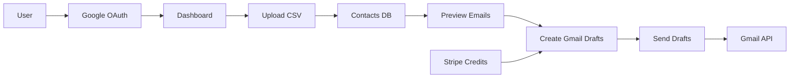
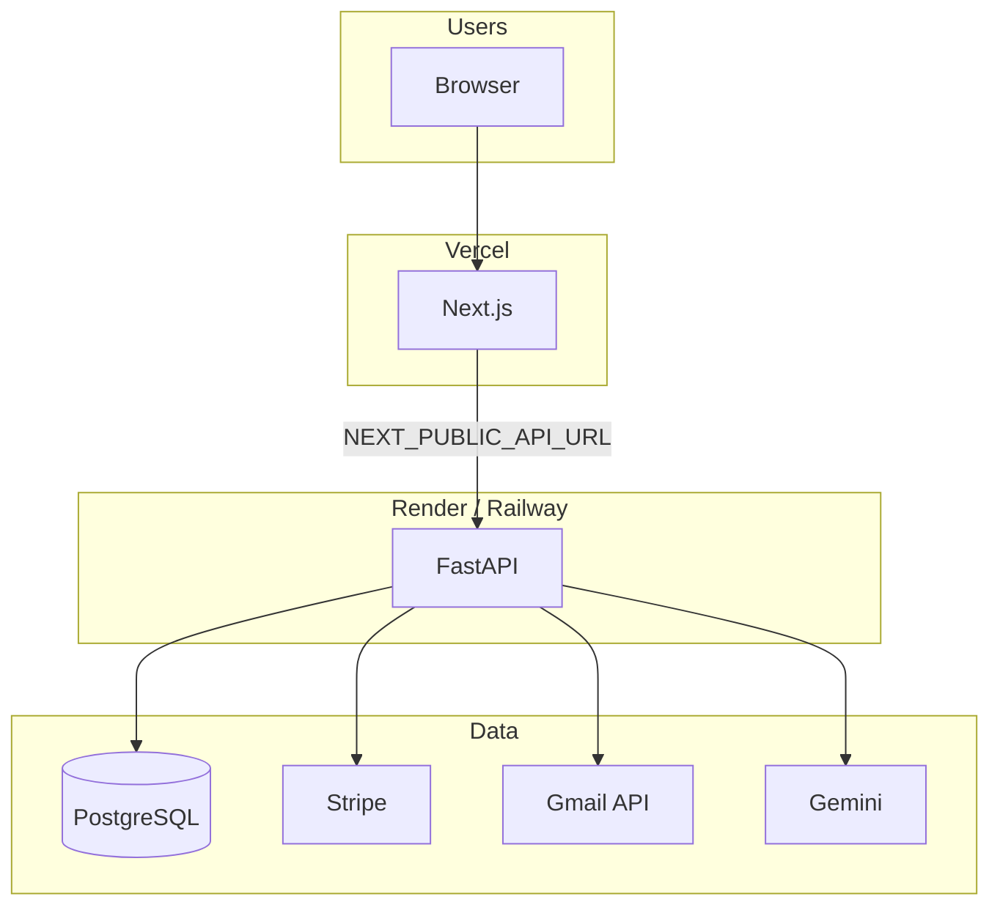

# Take OutreachPro to the World

## To-do / Completed (in order)

- **T1** Railway deployment fixes (Backend/Deploy)
- **T2** Stats API contract – backend (Backend/Deploy)
- **T3** Health check endpoint (Backend/Deploy)
- **T4** Optional: rate limiting (Backend/Deploy)
- **T5** File structure cleanup (Repo/Structure)
- **T6** Dashboard stats – frontend (Frontend; do after T2)
- **T7** OAuth URL – login/signup (Frontend)
- **T8** Legal pages – Privacy, Terms (Frontend)
- **T9** Production env and deployment docs (Docs/Config)
- **T10** Launch checklist (Docs/Config)

## Codebase summary

**OutreachPro** is an AI-powered cold email platform. Core flow:

- **Backend**: [app.py](c:\Users\ansha\Documents\Development\cold-email-outreach\app.py) — FastAPI, SQLite (dev) / PostgreSQL (prod), Google OAuth + JWT, Gmail API, Gemini ([src/llm_generator.py](c:\Users\ansha\Documents\Development\cold-email-outreach\src\llm_generator.py)), Stripe checkout + webhook, optional R2 backup ([src/storage.py](c:\Users\ansha\Documents\Development\cold-email-outreach\src\storage.py)).
- **Frontend**: [web/](c:\Users\ansha\Documents\Development\cold-email-outreach\web) — Next.js 16 (App Router), Tailwind, landing, login/signup, dashboard (stats, contacts, campaigns, drafts, settings, templates), pricing, docs. API client in [web/src/services/api.ts](c:\Users\ansha\Documents\Development\cold-email-outreach\web\src\services\api.ts) uses `NEXT_PUBLIC_API_URL` or `/api` (dev rewrite to backend).
- **Infra**: [Dockerfile](c:\Users\ansha\Documents\Development\cold-email-outreach\Dockerfile) for backend; README suggests Vercel (frontend) + Render/Railway (backend).

---

## 1. Pre-launch: fix critical gaps

| Gap                              | Location                                                                                                                                                                                                              | Action                                                                                                                                                                                                                                                                                                                                                 |
| -------------------------------- | --------------------------------------------------------------------------------------------------------------------------------------------------------------------------------------------------------------------- | ------------------------------------------------------------------------------------------------------------------------------------------------------------------------------------------------------------------------------------------------------------------------------------------------------------------------------------------------------ |
| **Login OAuth URL hardcoded**    | [web/src/app/login/page.tsx](c:\Users\ansha\Documents\Development\cold-email-outreach\web\src\app\login\page.tsx) line 8                                                                                              | Use `process.env.NEXT_PUBLIC_API_URL                                                                                                                                                                                                                                                                                                                   |
| **Signup page**                  | [web/src/app/signup/page.tsx](c:\Users\ansha\Documents\Development\cold-email-outreach\web\src\app\signup\page.tsx)                                                                                                   | Ensure signup also redirects to backend OAuth URL (same env var).                                                                                                                                                                                                                                                                                      |
| **Dashboard stats API contract** | Backend [app.py](c:\Users\ansha\Documents\Development\cold-email-outreach\app.py) `/api/stats` vs [web/src/services/api.ts](c:\Users\ansha\Documents\Development\cold-email-outreach\web\src\services\api.ts) `Stats` | Backend returns `total, sent, draft, pending, failed` and does not return credits. Frontend expects `credits_available, total_sent, total_drafted, failed_emails`. Either (a) extend `/api/stats` to include `credits` from user and align field names, or (b) have dashboard call `/api/auth/me` for credits and map response fields in the frontend. |
| **Missing Python deps**          | [requirements.txt](c:\Users\ansha\Documents\Development\cold-email-outreach\requirements.txt)                                                                                                                         | Add `python-jose[cryptography]` (used in [src/auth.py](c:\Users\ansha\Documents\Development\cold-email-outreach\src\auth.py)). Add `boto3` if you use R2 in production ([src/storage.py](c:\Users\ansha\Documents\Development\cold-email-outreach\src\storage.py)).                                                                                    |
| **CORS / allowed origins**       | [app.py](c:\Users\ansha\Documents\Development\cold-email-outreach\app.py)                                                                                                                                             | Ensure production frontend origin (e.g. `https://yourdomain.com`) is in `origins` via `FRONTEND_URL`.                                                                                                                                                                                                                                                  |
| **Google OAuth redirect URI**    | Google Cloud Console                                                                                                                                                                                                  | Add production callback URL (e.g. `https://api.yourdomain.com/api/auth/callback`).                                                                                                                                                                                                                                                                     |
| **Stripe**                       | Dashboard + .env                                                                                                                                                                                                      | Use live keys and set `STRIPE_WEBHOOK_SECRET` for production; configure webhook endpoint to point to your backend `/api/stripe/webhook`.                                                                                                                                                                                                               |

---

## 2. File structure cleanup

Current layout mixes app code, dev/sample data, and docs. Cleanup goals: smaller deploy artifact, clearer repo, no user data in git.

| Item                       | Current                                                                                      | Action                                                                                                                                                                                                                                                                                         |
| -------------------------- | -------------------------------------------------------------------------------------------- | ---------------------------------------------------------------------------------------------------------------------------------------------------------------------------------------------------------------------------------------------------------------------------------------------- |
| **Root scripts**           | `check_db_tokens.py`, `cli.py`, `migrate_db.py`, `simulate_webhook.py`, `test_gmail_auth.py` | Move to `scripts/` (or keep `migrate_db.py` at root if you run it from project root). Update any docs that reference them.                                                                                                                                                                     |
| **Legacy static frontend** | `static/index.html`                                                                          | If Next.js ([web/](c:\Users\ansha\Documents\Development\cold-email-outreach\web)) is the only frontend in production, remove `static/` and the route in [app.py](c:\Users\ansha\Documents\Development\cold-email-outreach\app.py) that serves it; or keep and document as “backend-only demo”. |
| **Sample data**            | `data/*.csv`, `data/tracking.json`                                                           | Add `data/` to [.dockerignore](c:\Users\ansha\Documents\Development\cold-email-outreach.dockerignore) so sample CSVs are not in the deploy image. Optionally move to `samples/` and add `samples/` to .dockerignore.                                                                           |
| **Uploads**                | `uploads/` (user files)                                                                      | Already in .gitignore and .dockerignore. Ensure app creates `uploads/` at runtime ([app.py](c:\Users\ansha\Documents\Development\cold-email-outreach\app.py) already does `UPLOAD_DIR.mkdir(exist_ok=True)`). No change needed.                                                                |
| **Agent/design docs**      | `.agent/`, `design-system/`                                                                  | Add to [.dockerignore](c:\Users\ansha\Documents\Development\cold-email-outreach.dockerignore) to avoid copying into Docker image. Keeps image smaller; no runtime impact.                                                                                                                      |
| **Email templates**        | `templates/` (concise.txt, professional.txt)                                                 | Used by backend; keep at root or move into `src/templates/` and update [src/email_generator.py](c:\Users\ansha\Documents\Development\cold-email-outreach\src\email_generator.py) (or equivalent) paths.                                                                                        |
| **Config**                 | `config/profile.json`                                                                        | Keep; optionally add `config/` to .dockerignore if not needed in production.                                                                                                                                                                                                                   |

**Minimal safe cleanup (no code moves):** Extend `.dockerignore` with: `data/`, `.agent/`, `design-system/`, `static/` (if you remove the static route), and any `scripts/` or `samples/` you add. That alone reduces image size and avoids shipping dev-only files.

---

## 3. Railway deployment fixes (stop crashes)

Railway expects the app to listen on `**$PORT**`. If the process binds to a fixed port (e.g. 8000) or doesn’t read `PORT`, health checks fail and the deployment is marked as crashed.

| Cause                                     | Fix                                                                                                                                                                                                                                                                                                                                                                       |
| ----------------------------------------- | ------------------------------------------------------------------------------------------------------------------------------------------------------------------------------------------------------------------------------------------------------------------------------------------------------------------------------------------------------------------------- |
| **Port hardcoded**                        | [app.py](c:\Users\ansha\Documents\Development\cold-email-outreach\app.py) ends with `uvicorn.run(app, host="0.0.0.0", port=8000)`. Railway sets `PORT` (e.g. 8080). Change to `port=int(os.getenv("PORT", 8000))` so the app listens on Railway’s port.                                                                                                                   |
| **Docker CMD doesn’t expand $PORT**       | [Dockerfile](c:\Users\ansha\Documents\Development\cold-email-outreach\Dockerfile) uses `CMD uvicorn app:app --host 0.0.0.0 --port ${PORT:-8000}`. In Docker **exec** form, env vars are not expanded. Use **shell** form: `CMD ["sh", "-c", "uvicorn app:app --host 0.0.0.0 --port ${PORT:-8000}"]`, or rely on `python app.py` and fix the port in app.py (recommended). |
| **Missing dependency at import**          | [src/auth.py](c:\Users\ansha\Documents\Development\cold-email-outreach\src\auth.py) uses `from jose import JWTError, jwt`. `python-jose[cryptography]` is not in [requirements.txt](c:\Users\ansha\Documents\Development\cold-email-outreach\requirements.txt). Add it; otherwise the app crashes on startup when loading auth.                                           |
| **Optional: explicit start for Nixpacks** | If you deploy **without** Docker, Railway uses Nixpacks. Provide a start command that reads `PORT`. Add a **Procfile** in project root: `web: uvicorn app:app --host 0.0.0.0 --port $PORT` (Railway will use this), or set the start command in Railway dashboard to the same.                                                                                            |

**Recommended:** (1) Add `python-jose[cryptography]` to `requirements.txt`. (2) In `app.py`, replace `port=8000` with `port=int(os.getenv("PORT", 8000))`. (3) If using Docker, either keep CMD as-is and rely on the fixed port in app.py when you run `python app.py`, or use shell-form CMD so `$PORT` is expanded when running `uvicorn` directly. (4) In Railway, attach a PostgreSQL service and set `DATABASE_URL`; ensure all required env vars (e.g. `SECRET_KEY`, `JWT_SECRET`, `GOOGLE_CLIENT_ID`, `GOOGLE_CLIENT_SECRET`, `GEMINI_API_KEY`, `FRONTEND_URL`, Stripe keys) are set so the app doesn’t fail during startup or first request.

---

## 4. Production environment and secrets

- **Backend env (Render/Railway/other)**: `SECRET_KEY`, `JWT_SECRET`, `FRONTEND_URL`, `GOOGLE_CLIENT_ID`, `GOOGLE_CLIENT_SECRET`, `GEMINI_API_KEY`, `STRIPE_SECRET_KEY`, `STRIPE_WEBHOOK_SECRET`, `DATABASE_URL` (PostgreSQL). Optional: R2 vars for upload backup.
- **Frontend env (Vercel)**: `NEXT_PUBLIC_API_URL` = backend base URL (e.g. `https://api.outreachpro.com`).
- **Database**: Run migrations if you add any (e.g. [migrate_db.py](c:\Users\ansha\Documents\Development\cold-email-outreach\migrate_db.py)); ensure PostgreSQL is used in prod (no SQLite).

---

## 5. Deployment architecture

- **Frontend**: Deploy `web/` to Vercel (build: `next build`, output: `.next`). Set `NEXT_PUBLIC_API_URL`. No rewrites to localhost in production; all API calls go to backend URL.
- **Backend**: Deploy root (with [Dockerfile](c:\Users\ansha\Documents\Development\cold-email-outreach\Dockerfile) or `pip install` + `uvicorn app:app --host 0.0.0.0 --port $PORT`). Attach PostgreSQL; set all env vars above.
- **Stripe webhook**: URL = `https://<backend-host>/api/stripe/webhook`; enable `checkout.session.completed`. Webhook secret in `STRIPE_WEBHOOK_SECRET`.

---

## 6. Optional: production hardening

- **Health check**: Add `GET /health` (e.g. DB ping) for platform health checks.
- **Rate limiting**: Consider per-IP or per-user limits on `/api/draft` and send endpoints to avoid abuse.
- **Legal pages**: Add real routes and content for Privacy and Terms (footer links currently point to `#`).
- **Monitoring**: Add error tracking (e.g. Sentry) and basic logging for auth failures and Stripe webhooks.

---

## 7. Taking it to the world (go-to-market)

- **Domain and branding**: Register a domain; point app (Vercel) and API (backend) to it; optionally use subdomains (e.g. `app.` and `api.`).
- **Launch channels**: Product Hunt, Indie Hackers, cold-email / job-seeker / recruiter communities (Reddit, LinkedIn, X), and a short launch post linking to landing + pricing.
- **Content and SEO**: Use [docs/](c:\Users\ansha\Documents\Development\cold-email-outreach\docs) (e.g. [email_finding_guide.md](c:\Users\ansha\Documents\Development\cold-email-outreach\docs\email_finding_guide.md)); expose as `/docs` and add a simple sitemap or meta for “cold email”, “AI outreach”, “Gemini”.
- **Feedback loop**: Add a minimal feedback mechanism (e.g. typeform or email) and monitor Stripe + usage to iterate on pricing and limits.

---

## 8. Suggested order of work

1. **Railway fixes (stop crashes):** Add `python-jose[cryptography]` to `requirements.txt`; in `app.py` use `port=int(os.getenv("PORT", 8000))`; set all required env vars and PostgreSQL in Railway. Optionally add Procfile or fix Dockerfile CMD for `$PORT`.
2. **File structure:** Extend `.dockerignore` with `data/`, `.agent/`, `design-system/`; optionally move root scripts to `scripts/` and remove or document `static/`.
3. Fix OAuth URL (login/signup), stats/credits contract; verify end-to-end locally with production-like env.
4. Set up PostgreSQL and production env vars; deploy backend then frontend; configure Stripe and Google OAuth for production URLs.
5. Add health check and (optional) rate limiting; ship Privacy/Terms and monitoring if desired.
6. Connect domain, then run launch and content/SEO as above.

---

## 9. Parallel agent todo list

Tasks are medium-sized (one logical feature each). **Dependencies** and **Stream** are set so agents can work in parallel; tasks in the same stream share files and should be assigned to one agent or done in order; tasks in different streams can run in parallel.

**Contract:** Backend `/api/stats` response shape (for T2/T6) is defined under T2 so frontend (T6) can implement after or in sync.

| ID      | Task                                   | Scope / files                                                              | Acceptance criteria                                                                                                                                                                                                                                                                        | Dependencies  | Stream                                                                                                                      |
| ------- | -------------------------------------- | -------------------------------------------------------------------------- | ------------------------------------------------------------------------------------------------------------------------------------------------------------------------------------------------------------------------------------------------------------------------------------------ | ------------- | --------------------------------------------------------------------------------------------------------------------------- |
| **T1**  | **Railway deployment fixes**           | `requirements.txt`, `app.py`, `Dockerfile`, `Procfile` (new)               | (1) `python-jose[cryptography]` in requirements.txt. (2) `app.py` uses `port=int(os.getenv("PORT", 8000))` in `uvicorn.run`. (3) Procfile present: `web: uvicorn app:app --host 0.0.0.0 --port $PORT`. (4) Dockerfile CMD uses shell form so `$PORT` expands, or CMD runs `python app.py`. | None          | Backend / Deploy                                                                                                            |
| **T2**  | **Stats API contract (backend)**       | `app.py` (`/api/stats`)                                                    | (1) `/api/stats` returns `credits_available` (from `user.credits`), `total_sent`, `total_drafted`, `pending`, `failed_emails` (map from current `sent`, `draft`, `pending`, `failed`). (2) Response is JSON; existing auth/db behavior unchanged.                                          | None          | Backend / Deploy                                                                                                            |
| **T3**  | **Health check endpoint**              | `app.py`                                                                   | (1) `GET /health` exists. (2) Returns 200 and optionally checks DB (e.g. simple query or connect). (3) No auth required.                                                                                                                                                                   | None          | Backend / Deploy                                                                                                            |
| **T4**  | **Optional: rate limiting**            | `app.py`, optional new deps (e.g. `slowapi`)                               | (1) Rate limit applied to `/api/draft` and `/api/send`, `/api/send-all` (e.g. per-IP or per-user). (2) Document in README or code comment.                                                                                                                                                 | None          | Backend / Deploy                                                                                                            |
| **T5**  | **File structure cleanup**             | `.dockerignore`, optionally `scripts/`, `static/`, `app.py`                | (1) `.dockerignore` includes `data/`, `.agent/`, `design-system/`. (2) Optionally: root scripts moved to `scripts/` and references updated; `static/` removed or documented and route removed from `app.py`. (3) No breaking change to running app.                                        | None          | Repo / Structure                                                                                                            |
| **T6**  | **Dashboard stats (frontend)**         | `web/src/services/api.ts`, `web/src/app/dashboard/page.tsx`                | (1) `Stats` type and `fetchStats()` use backend shape: `credits_available`, `total_sent`, `total_drafted`, `failed_emails`, `pending`. (2) Dashboard displays these; no duplicate call for credits unless needed for other UI.                                                             | T2 (contract) | Frontend                                                                                                                    |
| **T7**  | **OAuth URL (login/signup)**           | `web/src/app/login/page.tsx`, `web/src/app/signup/page.tsx`                | (1) Google OAuth redirect uses `(process.env.NEXT_PUBLIC_API_URL                                                                                                                                                                                                                           |               | '') + '/api/auth/google'` (no hardcoded localhost). (2) Signup page uses same base URL for OAuth if it has a Google button. |
| **T8**  | **Legal pages (Privacy, Terms)**       | `web/src/app/privacy/page.tsx`, `web/src/app/terms/page.tsx`, footer links | (1) Routes `/privacy` and `/terms` exist with placeholder or real content. (2) Footer links point to `/privacy` and `/terms` instead of `#`.                                                                                                                                               | None          | Frontend                                                                                                                    |
| **T9**  | **Production env and deployment docs** | `.env.example`, `README.md`                                                | (1) `.env.example` lists all required vars (PORT, DATABASE_URL, FRONTEND_URL, GOOGLE_*, GEMINI_*, STRIPE_*, JWT_SECRET, SESSION_SECRET, optional R2). (2) README deployment section mentions Railway, required env vars, and Stripe/Google OAuth production setup.                         | None          | Docs / Config                                                                                                               |
| **T10** | **Launch checklist**                   | New doc or README section, e.g. `docs/LAUNCH_CHECKLIST.md`                 | (1) Checklist: domain/DNS, backend URL, frontend NEXT_PUBLIC_API_URL, PostgreSQL, Stripe live + webhook URL, Google OAuth redirect URI, FRONTEND_URL/CORS. (2) Short go-to-market bullets (Product Hunt, Indie Hackers, communities, SEO).                                                 | None          | Docs / Config                                                                                                               |

**Parallel execution guide**

- **Agent A (backend/deploy):** T1 → T2 → T3 → T4 (T4 optional). Same repo area; run in order or T2/T3/T4 in parallel after T1.
- **Agent B (repo/structure):** T5 only. No overlap with A/C/D.
- **Agent C (frontend):** T7 and T8 in parallel; T6 after T2 is done (or when contract is agreed).
- **Agent D (docs/config):** T9 and T10 in parallel.

**Critical path:** T1 and T2 should complete before deploy; T6 after T2. T5, T7, T8, T9, T10 have no blockers and can start immediately.